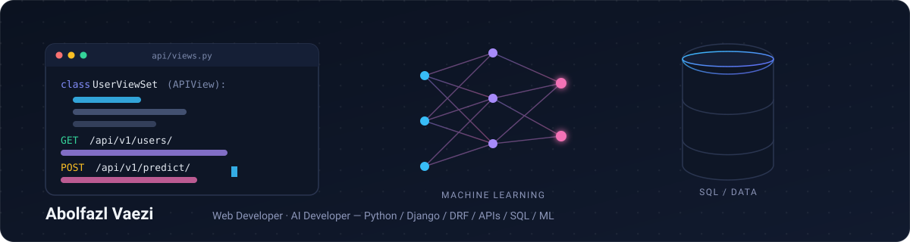
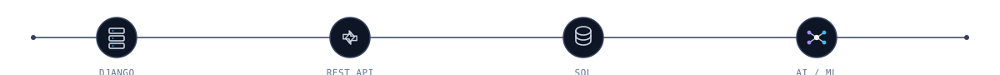

<!-- EDIT: INTRO -->

** Web Developer · AI Developer**

Building production-ready web applications, REST APIs, and practical AI-powered software with **Python**, **Django**, and modern web technologies.

<!-- END EDIT -->

 

  

** Featured Projects**

**LifeOn.tech** · **Mamanema.ir** · **Elajavan.ir** · **CRM NetPardaz** · **CarbonLedger.AI**

  

  

** Tech Stack**

<!-- EDIT: STACK -->

** AI & Machine Learning**

`Machine Learning` · `Deep Learning` · `Artificial Intelligence`

** AI & Data Libraries**

`NumPy` · `Pandas`

** Backend Development**

  

** Web Development**

  

** APIs & Databases**

`Django REST Framework` · `REST APIs` · `SQL` · `MySQL`

** Development Tools**

  

** Cybersecurity**

`Kali Linux` · `Bash`

<!-- END EDIT -->

 

**  AI & Technology Interests**

<!-- EDIT: AI INTERESTS -->

<table>
<tr>
<td width="33%" valign="top">

<strong>Artificial Intelligence</strong>

Artificial Intelligence
Machine Learning
Deep Learning
Practical AI Applications

</td>
<td width="33%" valign="top">

<strong>Software Development</strong>

Backend Development
REST APIs
Web Applications
Automation

</td>
<td width="33%" valign="top">

<strong>Engineering</strong>

Software Engineering
Database Systems
Algorithms & Data Structures
Scalable Systems

</td>
</tr>
</table>

<!-- END EDIT -->

 

** Background**

<!-- EDIT: BACKGROUND -->

**Web Developer · AI Developer**

I build web applications and backend systems with **Python and Django**, with a growing focus on practical **Artificial Intelligence** applications.

My work includes **REST APIs, database-driven applications, web platforms, software automation, and AI-powered software**, with an emphasis on building useful and maintainable systems.

Interested in:

`Backend Engineering` · `Web Development` · `Artificial Intelligence` · `Machine Learning` · `Deep Learning` · `Automation` · `REST APIs` · `Software Engineering`

<!-- END EDIT -->

 

  

** GitHub Activity**

<!-- EDIT: GITHUB ACTIVITY -->

<!-- END EDIT -->

 

** Connect**

<!-- EDIT: CONNECT -->

 

  Building, learning, and improving one product at a time.

<!-- END EDIT -->
